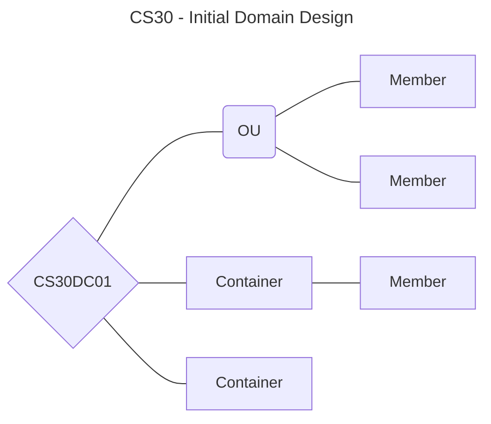

In my [previous post](https://v3ntus.github.io/posts/homelab/), I setup my new PowerEdge tower server with Proxmox, TrueNAS, Docker, and other self-hosted services. In this post, I'll recall how I initiated a virtualized Active Directory domain within a Hyper-V Server guest instance. All of my current knowledge is accumulated from previous college courses, self-exploration, and documentation, so I'm certainly in *no way an expert*. This will mainly be a "make it up as you go" experience.

# Planning
The Microsoft docs are admittedly a wonderful resource. There's a page about [Active Directory Domain Design and Planning](https://learn.microsoft.com/en-us/windows-server/identity/ad-ds/plan/ad-ds-design-and-planning) explaining certain aspects to consider for the situation at hand, whether that be an RODC, multiple forest setups, or other complex situations.

Essentially, at the core of an AD domain, a domain controller needs to exist. From there expands OU's and containers then groups, users, computers and other objects. Let's start with that.

> I'll use Draw.io on my end to diagram my network, but Chirpy (this Jekyll theme) supports Mermaid, which is Markdown-like diagrams. I'll be using that on my posts.

The domain name will be `CS30` for kicks and giggles. I'll follow a simple, standard naming convention for most objects.

> Also, have you been getting the [reference](https://getyarn.io/yarn-clip/5b0be1ac-8d4e-4c6f-9f33-d9c60a205bec)?