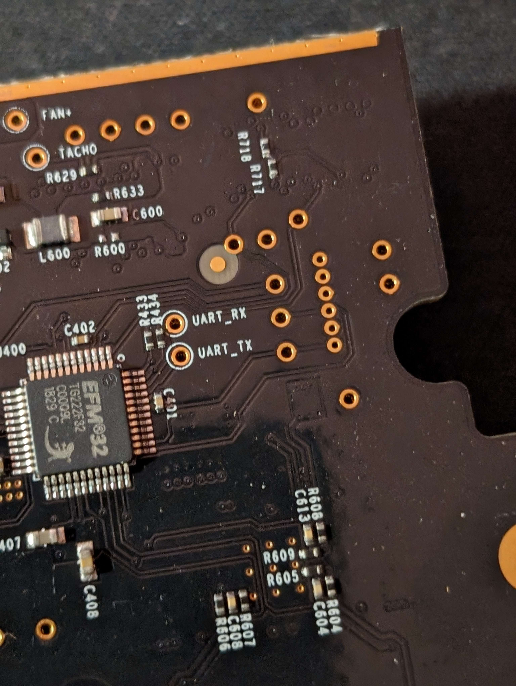
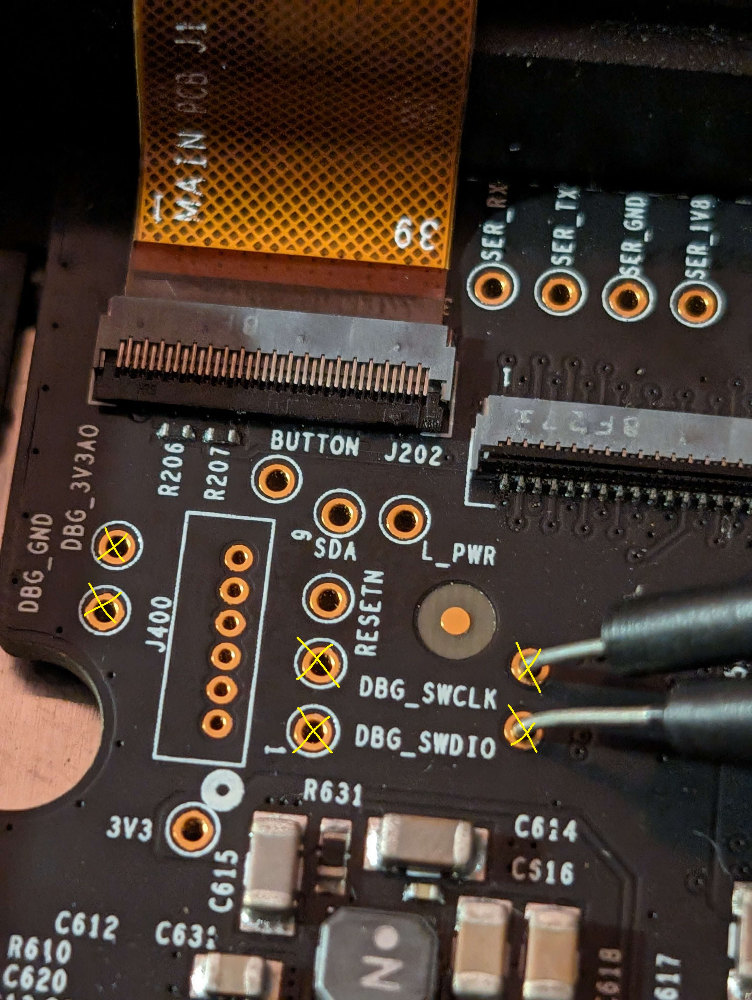

[In a recent post](https://v3ntus.github.io/posts/sony-shoot/), I got myself an Atomos Ninja V and brought it on a Sony film set to shoot some BTS. For context, the [Atomos Ninja V](https://web.archive.org/web/20231130120253/https://www.atomos.com/products/ninja-v) (now archived) is a powerful monitor and recorder for videographers that is capable of recording ProRes 4k RAW video and more.

Obviously, the hardware here is pretty powerful, but it's marketed for videographers. Let's hack it instead.

# Extracting the Firmware  
First thing we need is an image of whatever's running on the device. Now some might dump the firmware from a EEPROM chip or NAND. Some might just look to see if the manufacturer supplies firmware update images. Since that last one looks easier, let's do that. At the time of this post, yes, Ninja V firmware updates are available to download.

## Obtaining a firmware image online  

<p align="center"><a href="https://www.atomos.com/product-support/">Atomos Product Support</a> provides firmware packages for their products.</p><br>

EZ. Time to unzip. After the unzip, we have a supposed firmware file, release notes, and oddly a `__MACOSX` Mac OS resource fork. 

```
ventus@Ventus-PC:~/atomos$ ls
ATOMNJV.FW  AtomOS_10.94.01_NINJAV_Release_Notes.html  __MACOSX
```

## Taking a peek inside
The firmware file is the most appealing to me right now so let's figure out how to peek inside it.

```
ventus@Ventus-PC:~/atomos$ file ATOMNJV.FW
ATOMNJV.FW: TIM image, Pixel at (7,0) Size=1052x0
```

`file` output looks useless (maybe). Did some research on the TIM image file format and apparently it's used for PlayStation development. That doesn't sound relevant. How about `binwalk`? Might get some more valuable info on the signatures found in the file.

```
ventus@Ventus-PC:~/atomos$ binwalk ATOMNJV.FW

DECIMAL       HEXADECIMAL     DESCRIPTION
--------------------------------------------------------------------------------
2144          0x860           gzip compressed data, from Unix, last modified: 1970-01-01 00:00:00 (null date)
126286871     0x786FC17       COBALT boot rom data (Flat boot rom or file system)
177635818     0xA9681EA       MySQL ISAM index file Version 7
234434301     0xDF92EFD       Nagra Constant_KEY IDEA_Key: 10192431 38B6EFF1 E25FCAC3
242241596     0xE70503C       Flattened device tree, size: 46572 bytes, version: 17
243242660     0xE7F96A4       CRC32 polynomial table, little endian
243257864     0xE7FD208       Android bootimg, kernel size: 1920091392 bytes, kernel addr: 0x203A726F, ramdisk size: 1635151433 bytes, ramdisk addr: 0x2064696C, product name: ""
243317793     0xE80BC21       LZO compressed data
```

That's a lot to process. I would imagine most of these are false positives, but the first entry does look interesting. It's `gzip` data and occupies a large portion of the file supposedly from `0x860` to `0x786FC17`. We can verify that by `hexdump`ing the `head` of a file. Take a look at the `0x860` address.

```diff
ventus@Ventus-PC:~/atomos$ head ATOMNJV.FW | hexdump
0000000 0010 0000 6677 6173 0000 0100 0007 0000
...
+ 0000860 8b1f 0008 0000 0000 0300 d7ec b055 3790
```

On page 5 of the [gzip RFC](https://datatracker.ietf.org/doc/html/rfc1952), we see the specifications for member headers and trailers. ID1 and 2 are fixed values `0x1f` and `0x8b`, and we can see that in the first two bytes. The next two bytes indicate the compression method (`0x08` equating to `deflate`) then the three flag bytes (`0x0` which should be `FTEXT` but is probably not important here). Let's put these fixed bytes in another `binwalk` but using the raw sequence of bytes flag.

```
ventus@Ventus-PC:~/atomos$ binwalk -R "\x1f\x8b\x08" ATOMNJV.FW

DECIMAL       HEXADECIMAL     DESCRIPTION
--------------------------------------------------------------------------------
2144          0x860           Raw signature (\x1f\x8b\x08)
10462627      0x9FA5A3        Raw signature (\x1f\x8b\x08)
10474717      0x9FD4DD        Raw signature (\x1f\x8b\x08)
43784774      0x29C1A46       Raw signature (\x1f\x8b\x08)
48312778      0x2E131CA       Raw signature (\x1f\x8b\x08)
105409576     0x6486C28       Raw signature (\x1f\x8b\x08)
114979265     0x6DA71C1       Raw signature (\x1f\x8b\x08)
116786438     0x6F60506       Raw signature (\x1f\x8b\x08)
143345707     0x88B482B       Raw signature (\x1f\x8b\x08)
149922241     0x8EFA1C1       Raw signature (\x1f\x8b\x08)
151433372     0x906B09C       Raw signature (\x1f\x8b\x08)
159904359     0x987F267       Raw signature (\x1f\x8b\x08)
161603434     0x9A1DF6A       Raw signature (\x1f\x8b\x08)
174798694     0xA6B3766       Raw signature (\x1f\x8b\x08)
177702294     0xA978596       Raw signature (\x1f\x8b\x08)
185128728     0xB08D718       Raw signature (\x1f\x8b\x08)
189434130     0xB4A8912       Raw signature (\x1f\x8b\x08)
195538682     0xBA7AEFA       Raw signature (\x1f\x8b\x08)
206417564     0xC4DAE9C       Raw signature (\x1f\x8b\x08)
230582094     0xDBE674E       Raw signature (\x1f\x8b\x08)
241333466     0xE6274DA       Raw signature (\x1f\x8b\x08)
254533971     0xF2BE153       Raw signature (\x1f\x8b\x08)
```

Ah, now that's a lot more results. The last found signature starts at address `0xF2BE153` where the original scan stopped at `0x786FC17`. This is likely due to the original signature scan finding false positives while seeking within the gzip data. Since gzip members are not delimited, we cannot easily find the EOF which means `binwalk` didn't know exactly where the gzip ended and just searched every address. Gzip trailers do consist of a CRC, but it might just be easier to strip garbage data instead of trying to determine and calculate the CRC on the fly seeking through the binary (we might be able to see if there are trailing zeroes after the last member, which might make it easier). Anyways back to extracting. `stat` gives us a file size of `267652476` or `0xFF40D7C`. We'll assume (and most likely overshoot) that the last gzip member runs to the end of the file and still extract enough. Although in the future, we'll probably need to ensure that when we repack this firmware, we're not overwriting trailing data past the last gzip member that we shouldn't be overwriting. Instead of using `binwalk` to extract, we'll just use `dd` to copy the bytes with an offset.

```
ventus@Ventus-PC:~/atomos$ dd if=ATOMNJV.FW bs=8 skip=268 of=fw.gz status=progress
261849384 bytes (262 MB, 250 MiB) copied, 43 s, 6.1 MB/s
33456291+1 records in
33456291+1 records out
267650332 bytes (268 MB, 255 MiB) copied, 43.9279 s, 6.1 MB/s
```

```
ventus@Ventus-PC:~/atomos$ gunzip fw.gz

gzip: fw.gz: decompression OK, trailing garbage ignored
```
```
ventus@Ventus-PC:~/atomos$ file fw
fw: DOS/MBR boot sector, code offset 0x3c+2, OEM-ID "mkfs.fat", sectors/cluster 128, reserved sectors 128, root entries 2048, Media descriptor 0xf8, sectors/FAT 128, sectors/track 63, heads 16, sectors 539091 (volumes > 32 MB), serial number 0xca18f21f, unlabeled, FAT (16 bit)
```

Sweet! As you can see, `gunzip` did find some garbage data. Probably wouldn't be a bad idea to figure out how it determines that garbage data. Let's `binwalk` the result first and get an overview.

## Walking the binary

```
ventus@Ventus-PC:~/atomos$ binwalk fw

DECIMAL       HEXADECIMAL     DESCRIPTION
--------------------------------------------------------------------------------
7911788       0x78B96C        CRC32 polynomial table, little endian
7991728       0x79F1B0        Copyright string: "Copyright (c) 1996-2008 Express Logic Inc. * ThreadX ARM9/RVDS Version G5.1.5.1 SN: 2923-115-1301 *"
113705113     0x6C70099       Xilinx Virtex/Spartan FPGA bitstream dummy + sync word
114499764     0x6D320B4       Intel x86 or x64 microcode, sig 0x020000c0, pf_mask 0x12000000, 2000-02-08, rev 0x2000000, size 2048
115001340     0x6DAC7FC       LZMA compressed data, properties: 0x88, dictionary size: 1073741824 bytes, uncompressed size: 256 bytes
115164534     0x6DD4576       Intel x86 or x64 microcode, sig 0x21890000, pf_mask 0x90200001, 2000-04-10, rev 0x-7fac0000, size 2048
115228793     0x6DE4079       LZMA compressed data, properties: 0x88, dictionary size: 0 bytes, uncompressed size: 136 bytes
115263529     0x6DEC829       Intel x86 or x64 microcode, sig 0x20000000, pf_mask 0x00, 2000-04-04, size 2048
115397674     0x6E0D42A       LZMA compressed data, properties: 0xC0, dictionary size: 0 bytes, uncompressed size: 1024 bytes
115933353     0x6E900A9       Xilinx Virtex/Spartan FPGA bitstream dummy + sync word
116302255     0x6EEA1AF       LZMA compressed data, properties: 0x90, dictionary size: 536870912 bytes, uncompressed size: 32 bytes
116385130     0x6EFE56A       Intel x86 or x64 microcode, sig 0x00048080, pf_mask 0x18080, 2008-01-31, rev 0x21200400, size 16777216
135790593     0x8180001       Copyright string: "Copyright (C) 2018  Intel Corporation. All rights reserved."
135791457     0x8180361       Unix path: /home/luke/projects/phoenix_scratch/fpga/syn/expansion/exp_common/output_files/exp_common.pof Sat Apr 25 10:32:03 2020
140640257     0x8620001       Copyright string: "Copyright (C) 2018  Intel Corporation. All rights reserved."
140641121     0x8620361       Unix path: /home/luke/projects/phoenix_scratch/fpga/syn/expansion/exp_common/output_files/exp_common.pof Tue Apr 28 18:50:25 2020
144375808     0x89B0000       Flattened device tree, size: 7708440 bytes, version: 17
144376028     0x89B00DC       gzip compressed data, maximum compression, from Unix, last modified: 1970-01-01 00:00:00 (null date)
152035648     0x90FE140       Flattened device tree, size: 47248 bytes, version: 17
152174592     0x9120000       Flattened device tree, size: 43507384 bytes, version: 17
152174812     0x91200DC       gzip compressed data, maximum compression, from Unix, last modified: 1970-01-01 00:00:00 (null date)
159834432     0x986E140       Flattened device tree, size: 47248 bytes, version: 17
159881880     0x9879A98       gzip compressed data, maximum compression, from Unix, last modified: 1970-01-01 00:00:00 (null date)
188629687     0xB3E42B7       SHA256 hash constants, little endian
195690496     0xBAA0000       gzip compressed data, maximum compression, from Unix, last modified: 1970-01-01 00:00:00 (null date)
200262789     0xBEFC485       Zlib compressed data, compressed
```

That's quite a bit, but the data is much more promissing. FPGA bit streams, Intel microcode, more gzip data, LZMA data, Zlib data... mmm delicious.

> [!NOTE]  
> [Atomos has confirmed](https://www.redsharknews.com/technology-computing/item/74-fpgas-the-processing-powerhouse-behind-todays-video-technology) that the Ninja series utilizes FPGA technology for accelerated hardware processing. This backs the results `binwalk` gave us stating the firmware contains FPGA bitstreams. This'll be interesting to disect later as I'll probably disassemble the device to identify the FPGA model.

At this point, I found the [`radare2`](https://github.com/radareorg/radare2/) framework and figured it would be a good time to learn. So I took a little break from this and went off to read the [Radare book](https://book.rada.re/first_steps/intro.html).

I did run strings on the extracted `fw` file and found interesting entries in the MBR section of the file. The last line in this snippet hints at a UBOOT environment. If we find UART or JTAG, we could interrupt the bootloader and get a pre-boot environment shell.
```
ventus@Ventus-PC:~/atomos$ strings -10 fw | head -n 100
NO NAME    FAT16
This is not a bootable disk.  Please insert a bootable floppy and
press any key to try again ...
                !       "       #       $       %       &       '       (       )       *       +       ,       -       .       /       0       1       2       3       4       5       6       7       8       ~
                !       "       #       $       %       &       '       (       )       *       +       ,       -       .       /       0       1       2       3       4       5       6       7       8       ~
BOOTE~1JBE
APP0000 BIN
DAPP0000BIN
DATA0000BIN
DOCKUSB BIN
DPGA0000BIN
DPGA0001BIN
DPGA0002BIN
DPGA0003BIN
DPGA0005BIN
DPGA0006BIN
DPGA0009BIN
DPGA0012BIN
DPGA0013BIN
DPGA0014BIN
DPGA0015BIN
DPGA0017BIN
DPGA0018BIN
FMODDOCKBIN
FMODSTRMBIN
FWFAILEDBIN
MANIFESTXMD
PLS_WAITBIN
RES0001 BIN
SYNC0001BIN
SYNC0002BIN
SYNC0003BIN
SYNC0004BIN
SYNC0005BIN
XMODDOCKBIN
XMODSDI BIN
XMODSTRMBIN
XMODSYN BIN
FLASH   UB
GECKO_FWBIN
RAMDISK UB
ROOTFS  BIN
ROOTFS  TXT
UBOOT   ENV
...
```
Looking at the `hexdump` output of this part of the file, I tried to pick out any patterns such as addresses or metadata. I didn't really look too far so I skipped this for now. Could possibly be related to the U-Boot environment storage.
```
00030000  e5 65 00 76 00 6a 00 4e  00 00 00 0f 00 54 ff ff  |.e.v.j.N.....T..|
00030010  ff ff ff ff ff ff ff ff  ff ff 00 00 ff ff ff ff  |................|
00030020  e5 2e 00 75 00 62 00 6f  00 6f 00 0f 00 54 74 00  |...u.b.o.o...Tt.|
00030030  2e 00 65 00 6e 00 76 00  2e 00 00 00 4a 00 42 00  |..e.n.v.....J.B.|
00030040  e5 42 4f 4f 54 45 7e 31  4a 42 45 20 00 c2 76 17  |.BOOTE~1JBE ..v.|
00030050  8c 57 8c 57 00 00 76 17  8c 57 00 00 00 00 00 00  |.W.W..v..W......|
00030060  41 41 00 50 00 50 00 30  00 30 00 0f 00 b5 30 00  |AA.P.P.0.0....0.|
00030070  30 00 2e 00 62 00 69 00  6e 00 00 00 00 00 ff ff  |0...b.i.n.......|
00030080  41 50 50 30 30 30 30 20  42 49 4e 20 00 ab 76 17  |APP0000 BIN ..v.|
00030090  8c 57 8c 57 00 00 76 17  8c 57 03 00 98 a1 38 00  |.W.W..v..W....8.|
000300a0  41 44 00 41 00 50 00 50  00 30 00 0f 00 ef 30 00  |AD.A.P.P.0....0.|
000300b0  30 00 30 00 2e 00 62 00  69 00 00 00 6e 00 00 00  |0.0...b.i...n...|
```

## Extracting the corpse of an embedded Linux  
Using the manual `binwalk` method I did earlier, I went through the `fw` file and scanned for gzip members once again, but this time, adding a null byte to lessen false positives.
```
ventus@Ventus-PC:~/atomos$ binwalk -R "\x1f\x8b\x08\x00" fw

DECIMAL       HEXADECIMAL     DESCRIPTION
--------------------------------------------------------------------------------
144376028     0x89B00DC       Raw signature (\x1f\x8b\x08\x00)
152174812     0x91200DC       Raw signature (\x1f\x8b\x08\x00)
159881880     0x9879A98       Raw signature (\x1f\x8b\x08\x00)
195690496     0xBAA0000       Raw signature (\x1f\x8b\x08\x00)
```
Only four entries. Still, I'll extract a part of the file starting from the first address as the offset and going through to the end of the file.
```
ventus@Ventus-PC:~/atomos$ dd if=fw of=ext_fw.gz skip=764416 bs=256
313856+0 records in
313856+0 records out
80347136 bytes (80 MB, 77 MiB) copied, 0.417453 s, 192 MB/s
```
After decompressing it, we see that the file is an `ext4` filesystem. How interesting. Let's mount it.
```
ventus@Ventus-PC:~/atomos$ file ext_fw
ext_fw: Linux rev 1.0 ext4 filesystem data, UUID=bb14a1a5-f66d-42d2-920d-f8924401a174 (extents) (64bit) (large files) (huge files)
```

At this point, it's just appears to be a normal Linux directory structure. This'll take a bit to poke through.
```
ventus@Ventus-PC:~/atomos$ sudo mount ext_fw ./mnt/
ventus@Ventus-PC:~/atomos$ cd mnt/
ventus@Ventus-PC:~/atomos/mnt$ ls
bin  boot  dev  etc  home  lib  LICENSE  lost+found  media  mnt  proc  run  sbin  sys  tmp  usr  var
```

---
### `fstab`
Checking out `/etc/fstab`, there are interesting mount points for certain things pertaining to assets and boot files.
```
ventus@Ventus-PC:~/atomos/mnt/etc$ cat fstab
/dev/root       /                       auto    ro                              1  0
proc            /proc                   proc    defaults                                0  0
devpts          /dev/pts                devpts  mode=0620,gid=5                         0  0
tmpfs           /run                    tmpfs   mode=0755,nodev,nosuid,strictatime      0  0
tmpfs           /var/volatile           tmpfs   defaults                                0  0

/dev/mmcblk0p1  /media/boot             auto    defaults,ro,noatime     0  2
/dev/mmcblk0p2  /media/resources        auto    defaults,ro,noatime     0  2
/dev/mmcblk0p3  /media/static           auto    defaults,ro,noatime     0  2
# TODO not sure how to handle this
/dev/mmcblk0p6  /media/app              ext4    defaults,ro,noauto,noatime      0  2

# nonvolatile is marked as noauto, controlled by external script
/dev/mmcblk0p7  /var/nonvolatile        ext4    defaults,noauto,noatime,nofail,data=journal     0  2
```
`grep`-ing for the `mmcblk0` devices shows their presence in a few custom scripts and binaries.
```
ventus@Ventus-PC:~/atomos/mnt/etc$ sudo grep -rl "mmcblk0p" ../
../usr/sbin/partition-migrate
../usr/share/core_control/migration/migrate_settings
../usr/bin/core_control
../etc/fstab
```
The first scripts seemed to organize partitions after a system update. The next two were binaries possibly related to the update process, but I haven't disassembled them yet.

---

### `/etc/init.d`
Lots of stuff in here, but I removed a lot of entries that had uninteresting functionality. The ones listed appear to manage codec daemons responsible for audio and video recording.

```
ventus@Ventus-PC:~/atomos/mnt/etc/init.d$ ls -alh
total 212K
drwxr-xr-x  2 root root 4.0K Mar  9  2018 .
drwxr-xr-x 37 root root 4.0K Mar  9  2018 ..
-rwxr-xr-x  1 root root 3.0K Mar  9  2018 audio_encoder.sh
-rwxr-xr-x  1 root root 1.7K Mar  9  2018 core_control.sh
-rwxr-xr-x  1 root root 2.2K Mar  9  2018 partition-migrate.sh
-rwxr-xr-x  1 root root 7.1K Mar  9  2018 streaming_pl.sh
-rwxr-xr-x  1 root root 3.0K Mar  9  2018 talkback_pl.sh
-rwxr-xr-x  1 root root 4.2K Mar  9  2018 video_pipeline.sh
```

Looking in `video_pipeline.sh`, sounds like debug files lived in `/home/root`.

```bash
DAEMON=/usr/bin/video_pipeline
WRAPPER="$DAEMON.sh"
DEBUG_DAEMON=/home/root/video_pipeline
PERF_DAEMON=/home/root/perf/video_pipeline
NAME=video_pipeline
DESC="Video Pipeline service"
```

---

### OS Info - `/etc/issue`
- `/etc/issue` - `PetaLinux 2022.2_release_S10071807`

---

### `/etc/passwd` and `/etc/shadow`
<details>
  <summary><h3>Click to expand</h3></summary>

    ```sh
    # /etc/passwd
    root:x:0:0:root:/home/root:/bin/sh
    daemon:x:1:1:daemon:/usr/sbin:/bin/sh
    bin:x:2:2:bin:/bin:/bin/sh
    sys:x:3:3:sys:/dev:/bin/sh
    sync:x:4:65534:sync:/bin:/bin/sync
    games:x:5:60:games:/usr/games:/bin/sh
    man:x:6:12:man:/var/cache/man:/bin/sh
    lp:x:7:7:lp:/var/spool/lpd:/bin/sh
    mail:x:8:8:mail:/var/mail:/bin/sh
    news:x:9:9:news:/var/spool/news:/bin/sh
    uucp:x:10:10:uucp:/var/spool/uucp:/bin/sh
    proxy:x:13:13:proxy:/bin:/bin/sh
    www-data:x:33:33:www-data:/var/www:/bin/sh
    backup:x:34:34:backup:/var/backups:/bin/sh
    list:x:38:38:Mailing List Manager:/var/list:/bin/sh
    irc:x:39:39:ircd:/var/run/ircd:/bin/sh
    gnats:x:41:41:Gnats Bug-Reporting System (admin):/var/lib/gnats:/bin/sh
    core_control:x:800:800::/home/core_control:/bin/sh
    pipeline:x:801:801::/home/pipeline:/bin/sh
    cloud:x:802:802::/home/cloud:/bin/sh
    avahi:x:998:998::/run/avahi-daemon:/bin/false
    messagebus:x:999:999::/var/lib/dbus:/bin/false
    nobody:x:65534:65534:nobody:/nonexistent:/bin/sh

    # /etc/shadow
    root:*:15069:0:99999:7:::
    daemon:*:15069:0:99999:7:::
    bin:*:15069:0:99999:7:::
    sys:*:15069:0:99999:7:::
    sync:*:15069:0:99999:7:::
    games:*:15069:0:99999:7:::
    man:*:15069:0:99999:7:::
    lp:*:15069:0:99999:7:::
    mail:*:15069:0:99999:7:::
    news:*:15069:0:99999:7:::
    uucp:*:15069:0:99999:7:::
    proxy:*:15069:0:99999:7:::
    www-data:*:15069:0:99999:7:::
    backup:*:15069:0:99999:7:::
    list:*:15069:0:99999:7:::
    irc:*:15069:0:99999:7:::
    gnats:*:15069:0:99999:7:::
    core_control:!:15069::::::
    pipeline:!:15069::::::
    cloud:!:15069::::::
    avahi:!:15069::::::
    messagebus:!:15069::::::
    nobody:*:15069:0:99999:7:::
    ```
</details>

---

### `/etc/petalinux/`
<details>
  <summary><h3>Click to expand</h3></summary>

    ```sh
    # board
    atomos-ninjav

    # board-variant
    aarch64:armv8a:cortexa72-cortexa53:mali400:vcu:zynqmp:zynqmp-ev:atomos-ninjav

    # bsp
    atomos-ninjav

    # product
    atomos-ninjav-2022.2

    # soc
    zynqmp-ev

    # version
    1.00
    ```

</details>

---

Some other interesting things `grep`-ing the `fw` file. Sounds like the FPGA was designed through Intel Quartus.  
```
ventus@Ventus-PC:~/atomos$ strings fw | grep -A2 -B2 luke
!refer to the applicable agreement for further details.
!Quartus Prime SVF converter 18.0
!Device #1: 10M04SC - /home/luke/projects/phoenix_scratch/fpga/syn/expansion/exp_common/output_files/exp_common.pof Sat Apr 25 10:32:03 2020
!NOTE "USERCODE" "002BB7BE";
!NOTE "CHECKSUM" "02896B90";
--
!refer to the applicable agreement for further details.
!Quartus Prime SVF converter 18.0
!Device #1: 10M04SC - /home/luke/projects/phoenix_scratch/fpga/syn/expansion/exp_common/output_files/exp_common.pof Tue Apr 28 18:50:25 2020
!NOTE "USERCODE" "002D0A80";
!NOTE "CHECKSUM" "0284F936";
```

# Disassembly

## PCB BOM
- `EFM32-TG222F32` (TinyGecko 32bit ARM Cortex-M3 MCU) - [Link](https://www.silabs.com/mcu/32-bit-microcontrollers/efm32-tiny-gecko/device.efm32tg222f32-qfp48) (this points back to presence of a Gecko bootloader in the firmware)
- `H26M31001HPR` (4G NAND MMC) - [Link](https://www.kynix.com/Detail/1182694/H26M31001HPR.html)
- `H5AN4G6NAFR` (256M UHC) - [Link](https://www.findic.us/price/h5an4g6nafr-uhc-bLXabnnme.html)
- 2x `PS8409A` (6Gbps HDMI 2.0 repeater/retimer) - [Link](https://www.paradetech.com/products/ps8409a/)

## Headers
> UART:  
> 

> Debug:
> 