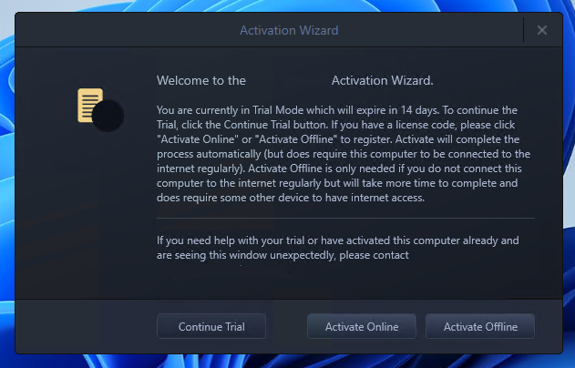
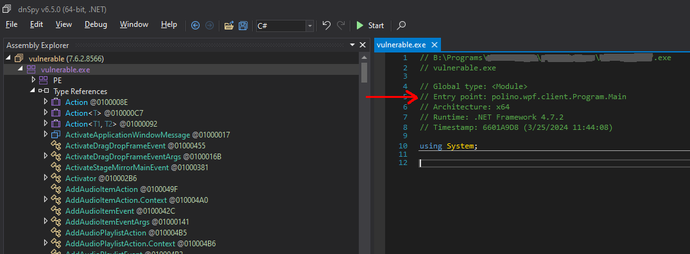
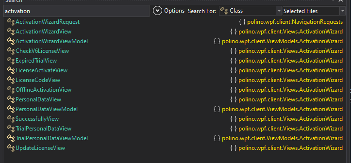
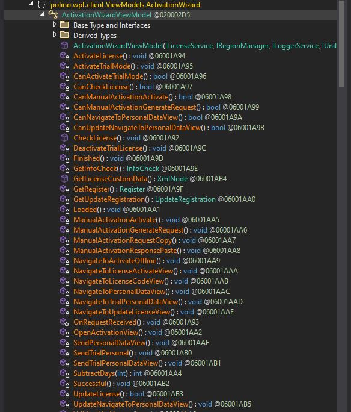
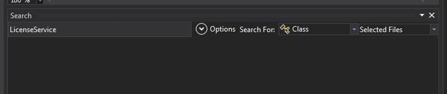
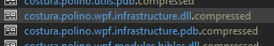
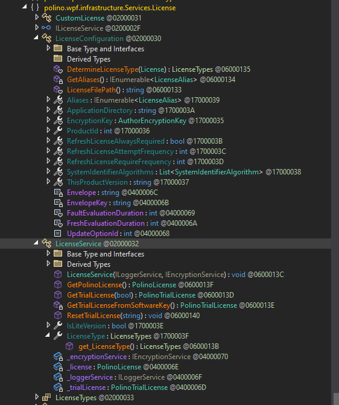
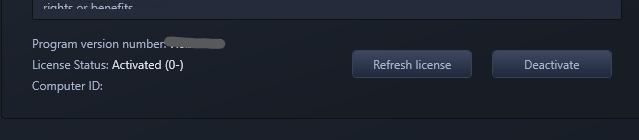

If you know anything about C#/.NET, it's that anyone can easily decompile and pick apart at your assemblies. And I'm talkin' using easy to find tools like [dnSpyEx](https://github.com/dnSpyEx) that decompile your binaries straight back to C#.
What does this mean for software developers? Well, say your company develops an in-house, crucial software stack that will be outsourced to 3rd party contractors. It's also built with Unity. 
Nothing wrong with Unity, it's capable. The issue lies when there are no integrity checks, [tamper protection](https://learn.microsoft.com/en-us/dotnet/framework/app-domains/gac), [DLL hijack mitigation](https://support.microsoft.com/en-us/topic/secure-loading-of-libraries-to-prevent-dll-preloading-attacks-d41303ec-0748-9211-f317-2edc819682e1), [code obfuscation](https://docs.unity3d.com/Manual/IL2CPP.html), etc. These are obviously not surefire ways to secure your application, but security is layers, and the more layers you have, the more deterrent your software is to the curious.

# "Why bother?"

It's all up to risk assessment. If your WPF app is only going to serve as a simple front-end for users to edit their Minecraft save file and you're not worried about the source code, then why bother?

Well, paint this picture in your head: What if your software operates through a company-issued VPN requiring MFA, then giving access to crucial, client assets? There's no trust in place for the software integrity, builds are distributed via email and circulated by low-tier employees through Google Drive links. It would be easy enough to craft a malicious DLL to hook onto the application process, zip it in an existing build, and pose as a dev pushing out the newest, coolest update. You already gave the code in the DLL free passage through the tunnel, it's just a matter of what you want to do while you're inside the gates. 

And that's exactly what happened.  

# MelonLoader in the Workplace

[MelonLoader](https://github.com/LavaGang/MelonLoader) is well known by the gaming community to add mod support to almost any Unity game. MelonLoader utilizes DLL proxying to serve a legitimate DLL to Unity, but also registering hooks to load custom code, or mods, inside the app process. Within a MelonLoader mod, you can utilize .NET reflection to access private/protected members and classes, hook onto the app/game functions to intercept their calls at runtime, and much more. Full code execution, no suspicious processes, no process migration needed.

The proof of concept I wrote in my vulnerability report opened an IPC pipe that let external apps control the Unity app on the victim's behalf. An excuse to send something to our client to cover our backs.

# "What's the worst that could happen?"

Let's say you start a software company with the goal of creating a product for users to manage their media and plan scripts for organizations. You charge licenses for your software, after all, a company is fueled on money. Joe Shmo comes in, sees the price of a license, doesn't quite like your numbers, and goes away to find an open-source alternative.


So that's kinda what happened, just with a different ending.

# Bypassing License Checks with dnSpy

## Prerequisites

I'll assume you'll know basic assembly and programming concepts, such as instruction sets, how compiling works, and the C# and IL reference/instruction set. You'll need Visual Studio as well, with the .NET Development bundle. I'm not going to hold your hand.

## Overview

[dnSpyEx](https://github.com/dnSpyEx) (forked from the original [dnSpy](https://github.com/dnSpy/dnSpy)) is a GUI for .NET decompilation and recompilation. It can decompile .NET assemblies back to C# or [IL (Intermediate Language)](https://learn.microsoft.com/en-us/dotnet/standard/managed-code#intermediate-language--execution). If you have the right reference assemblies, you can recompile the C# back into its binary form. Or if you're comfortable with assembly-like IL, you don't usually have to worry about references.

## Identifying a suspect

Usually I'll throw a binary/DLL into dnSpy and see what happens. If it's a valid .NET assembly, it'll give me the resources, references, and classes in the Assembly Explorer. If not, it'll just spit out a PE header and some other PE details. At that point, put it through [Ghidra](https://ghidra-sre.org/) and start at your entry point (or exports I guess if it's a library). While it isn't the scope of this article, I'd suggest checking out [stacksmashing](https://www.youtube.com/watch?v=Sv8yu12y5zM) on YouTube for a good Ghidra run-through video.

Well if you've made it this far and have your assembly in dnSpy, it should look kinda like this:
|  |
|:--:| 
| *Image Source: [BepInEx Docs](https://docs.bepinex.dev/articles/advanced/debug/plugins_dnSpy.html)* |

Hooray, you've found yourself an easy target.

## Tracing a path

The application immediately prompts for Activation on open:

|  |
|:--:|
| *Activation Wizard* |

Knowing this, we'll need to search for related classes near the entry point. dnSpy gives us the entry point if we click on the module or assembly:

|  |
|:--:|
| *Assembly entry point* |

In this case, I needed to find the [`OnStartup()`](https://learn.microsoft.com/en-us/dotnet/api/system.windows.application.onstartup?view=netframework-4.8.1) call. Inside this method were calls to display the splash screen, set up the bootstrapper, and show the main window. Nothing about showing a dialog box for activation though:
```cs
namespace polino.wpf.client
{
	public class App : Application
	{
		protected override void OnStartup(StartupEventArgs e)
		{
			base.OnStartup(e); // super call

            // ...

			this.ShowSplashScreen(cancellationTokenSource.Token); // breakpoint
			Bootstrapper bootstrapper = this.SetupBootstrapper(); // breakpoint
			cancellationTokenSource.Cancel();
			this.ShowMainWindow(bootstrapper.Shell); // breakpoint

            // ...
		}
    }
}
```

I hunted for the dialog call for hours, but ultimately figured it would be best to find the activation logic and patch that instead. Reason being is that we can update the UI however we like to bypass any requests to activate, but it won't change the fact that the application knows it's unlicensed. Instead of creating a facade, let's do the real thing. Doing a global search for classes that contain "activation" revealed promising results:

|  |
|:--:|
| *Multiple results for activation* |

The module that sticks out the most was `wpf.client.Views.ActivationWizard`, though this was essentially just a WPF interface of some sort. Going to `ViewModels.ActivationWizard` though gave more interesting results.

|  |
|:--:|
| *Some activation logic found* |

Different calls to fetch and update the license, activate trial and normal licenses, as well as WPF callbacks. We're getting closer, but we're not there yet. These all seem like "actions" done on the UI, but we need to find the source. Notice in the screenshot above that `ActivationWizardViewModel` is subclassing an `ILicenseService` class interface? Sounds like the next step, let's head that way.

|  |
|:--:|
| *...Where's `LicenseService`?* |

There's no definition for `LicenseService`? Yes it's a case insensitive search. Yes I'm not matching whole words. Yes the selected file is correct. How is this application referencing `LicenseService`?

Going back to the view model, the namespace is there:
```cs
// ...

using polino.wpf.infrastructure.Services.License;

// ...
```
Clicking on it gives me an empty window.
Usually in my experience, dnSpy can resolve these references to a file and import it if it was missing in the assembly explorer, but the fact that it couldn't means something else is going on.

Backing up a bit, I noticed a `Costura.AssemblyLoader` module as well as something similar in the root namespace:

```cs
using System;

// Token: 0x020004EF RID: 1263
internal class vulnerable_ProcessedByFody
{
	// Token: 0x040014F6 RID: 5366
	internal const string FodyVersion = "6.8.0.0";

	// Token: 0x040014F7 RID: 5367
	internal const string Costura = "5.7.0";
}
```

Some sort of metadata on [Fody](https://github.com/Fody/Fody), an IL weaver, post-processor for injecting functionality into an assembly. Alright, what about [Costura](https://github.com/Fody/Costura) then? Apparently an addon to Fody which lets you embed dependencies as resources. Well sure enough, there was our missing dependency:

|  |
|:--:|
| *Hiding in plain sight?* |

Using [this Costura decompressor](https://github.com/dr4k0nia/Simple-Costura-Decompressor), we can grab these resources out of the assembly and import them into dnSpy. Sure enough, clicking on the `ILicenseService` class interface gave us actual code this time. This is just the class interface, but we can resolve the real class in the same module. The methods are lookin' like what we've been after.

|  |
|:--:|
| *X marks the spot* |

## Trust me bro, I got a license

There are a few methods of attack here. Since we know the application accepts both offline and online activation, we can either reverse engineer the offline activation logic or we can just trick the application to thinking it always has a full, non-expiring license. You don't always get this opportunity, but we're gonna take the easy way out.

In the `Services.License` module, there are class methods that determine the license type. Here's the license types enum:

```cs
using System;

namespace polino.wpf.infrastructure.Services.License
{
	// Token: 0x02000033 RID: 51
	public enum LicenseTypes
	{
		// Token: 0x04000072 RID: 114
		Unlicensed,
		// Token: 0x04000073 RID: 115
		FullNonExpiring,
		// Token: 0x04000074 RID: 116
		TimeLimited = 10,
		// Token: 0x04000075 RID: 117
		Lite = 100,
		// Token: 0x04000076 RID: 118
		UK = 200,
		// Token: 0x04000077 RID: 119
		Lite_UK = 400
	}
}
```

I dunno about you, but that `FullNonExpiring` enum looks tasty. Let's overwrite any getters for this enum to return only `FullNonExpiring`. Here's an IL example and its CS equivalent. Since we know the `FullNonExpiring` enum value is 1, we'll push 1 to the evaluation stack and return it. Very simple:

```il
.method assembly hidebysig static 
	valuetype polino.wpf.infrastructure.Services.License.LicenseTypes DetermineLicenseType (
		class [PLUSManaged]com.softwarekey.Client.Licensing.License lic
	) cil managed 
{
	// Header Size: 12 bytes
	// Code Size: 59 (0x3B) bytes
	// LocalVarSig Token: 0x11000030 RID: 48
	.maxstack 2
	.locals init (
		[0] valuetype polino.wpf.infrastructure.Services.License.LicenseTypes 'type',
		[1] int32
	)

	/* (152,13)-(152,37) D:\a\1\s\polino.wpf.infrastructure\Services\License\LicenseConfiguration.cs */
	/* 0x00002BD0 02           */ IL_0000: ldc.i4.1
	/* 0x00002BD1 6F8301000A   */ IL_0001: ret
} // end of method LicenseConfiguration::DetermineLicenseType
```
```cs
// Token: 0x06000135 RID: 309 RVA: 0x000049C4 File Offset: 0x00002BC4
internal static LicenseTypes DetermineLicenseType(License lic)
{
	return LicenseTypes.FullNonExpiring;
}
```

Now we save the module and load up the app. Well we're missing a couple steps first. If you remember, the app used Costura to bundle this dependency internally. How do we bundle it back in? We don't have to. Theoretically, if we save this DLL right next to the executable and remove all Costura references to the internal bundled version in `Costura.AssemblyLoader`, it should load right up [thanks to abusing the dynamic-link library search order](https://learn.microsoft.com/en-us/windows/win32/dlls/dynamic-link-library-search-order).

After doing so, the application starts at the main menu instead of the activation dialog. I open the About window and lo and behold, we are activated.

|  |
|:--:|
| *We won* |

And that's how (*some*) cracks are made. If you're lucky, you get a .NET app like this and it's smooth sailing. Otherwise, I hope you enjoy learning assembly and RE.

If you charge $700 for a license and put it behind a .NET framework, why even bother?
